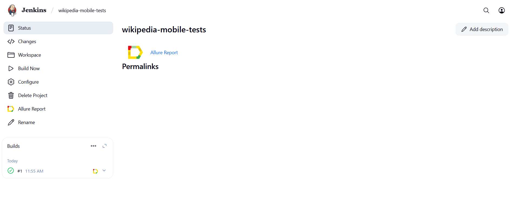
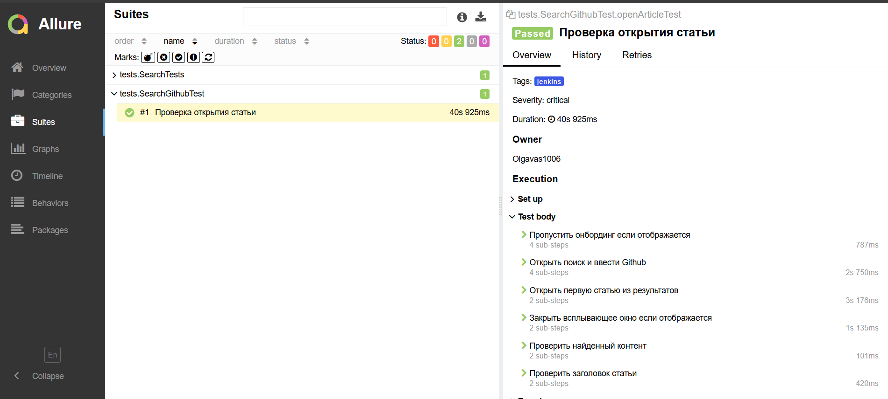

# Проект по автоматизации тестовых сценариев для [Wikipedia](https://ru.wikipedia.org/)
<p align="center">

</p>

> Википедия — многоязычная общедоступная интернет-энциклопедия со свободным контентом, поддержку и написание которой осуществляют добровольцы — «википедисты», посредством открытого сотрудничества и с использованием MediaWiki, системы редактирования на основе вики-принципов.

## Содержание

- [Используемый стек](#computer-используемый-стек)
- [Реализованные проверки](#-реализованные-проверки)
- [Запуск автотестов](#️-запуск-автотестов)
- [Запуск тестов из терминала](#запуск-тестов-из-терминала)
- [Сборка в Jenkins](#-сборка-в-jenkins)
- [Пример Allure-отчета](#-пример-allure-отчета)
- [Уведомления в Telegram с использованием бота](#-уведомления-в-telegram-с-использованием-бота)
- [Видео примера запуска тестов](#-видео-примера-запуска-тестов)

## Используемый стек
<p align="center">  
<a href="https://www.jetbrains.com/idea/"></a>  
<a href="https://www.java.com/"></a>  
<a href="https://www.android.com/"></a>  
<a href="https://developer.android.com/studio"></a>  
<a href="https://github.com/"></a>  
<a href="https://junit.org/junit5/"></a>  
<a href="https://gradle.org/"></a>  
<a href="https://selenide.org/"></a>  
<a href="https://www.browserstack.com/"></a> 
<a href="https://rest-assured.io/"></a> 
<a href="https://github.com/allure-framework/allure2"></a>  
<a href="https://qameta.io/"></a> 
<a href="https://www.jenkins.io/"></a>  
<a href="https://telegram.org/"></a>
</p>

Автотесты для мобильного приложения на `Android` разработаны на языке программирования `Java` с использованием фреймворков `Selenide` и `Appium`; `UIAutomator2` используется как Android драйвер.

В качестве фреймворка для запуска тестов используется `Junit5`, в качестве сборщика проекта - `Gradle`, конфигурация настроена с помощью библиотеки `Owner`.

Произведена настройка CI системы `Jenkins`, при запуске автотестов из которой выполнение тестов осуществляется в облачной ферме мобильных девайсов `Browserstack`. Для взаимодействия с `Browserstack API` используется библиотека `REST-assured`. По результатам каждого запуска автотестов создаётся `Allure` отчёт для визуализации результатов прогона.
При локальном запуске есть возможность использовать эмулятор `Android` девайса.

Реализована интеграция с `Allure TestOps` – системой тест-менеджмента для управления процессом тестирования.

После выполнения автотестов `Telegram` бот присылает сообщение с информацией о результатах запуска.

## Реализованные проверки

#### Поиск и открытие статей
* Проверка результатов поиска статей по ключевому слову
* Проверка отрытие статьи через поиск
* Проверка вывод пустого результата по запросу

## Запуск автотестов

### Запуск тестов из терминала

```
gradle clean jenkins
```

При выполнении данной команды в терминале IDE тесты запустятся удаленно в <code>Browserstack</code>.

##  Сборка в [Jenkins](https://jenkins.autotests.cloud/job/wikipedia-mobile-tests/)

Для запуска сборки необходимо нажать кнопку <code>Buld now</code>.
<p align="center">

</p>
После выполнения сборки, в блоке <code>Builds</code> напротив номера сборки появятся значки <code>Allure Report</code> и <code>Allure TestOps</code>, при клике на которые откроется страница со сформированным html-отчетом и тестовой документацией соответственно.

##  Пример [Allure-отчета](https://jenkins.autotests.cloud/job/wikipedia-mobile-tests/allure/#suites/dd0dde1ba6c83f48bb2bb479928136f4/3aa913ec354b54bf/)
Содержание Allure-отчета:

* Шаги теста;
* Скриншот страницы на последнем шаге;
* Page Source;
* Логи браузерной консоли;
* Видео выполнения автотеста.

<p align="center">

</p>

##  Уведомления в Telegram с использованием бота

После завершения сборки специальный бот, созданный в <code>Telegram</code>, автоматически обрабатывает и отправляет
сообщение с отчетом о прогоне тестов.

<p align="center">

</p>

##  Видео примера запуска тестов в Browserstack

В отчетах Allure для каждого теста прикреплено видео прохождения теста

<p align="center">
  
</p>

